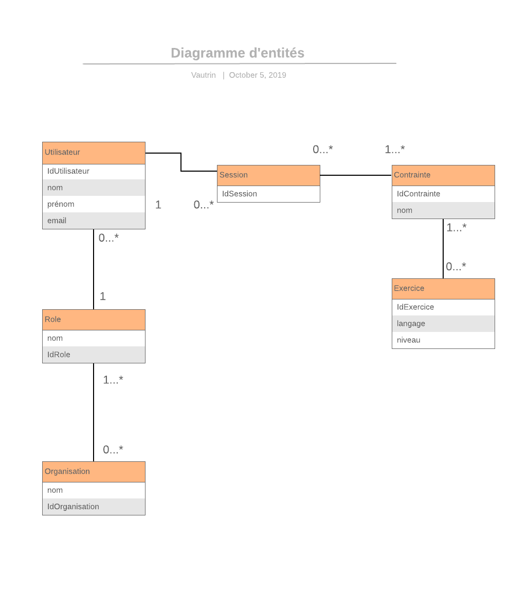
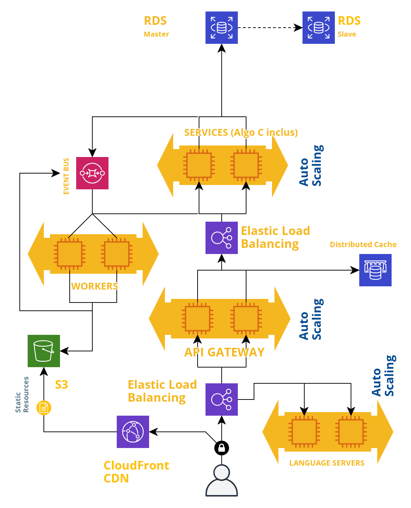
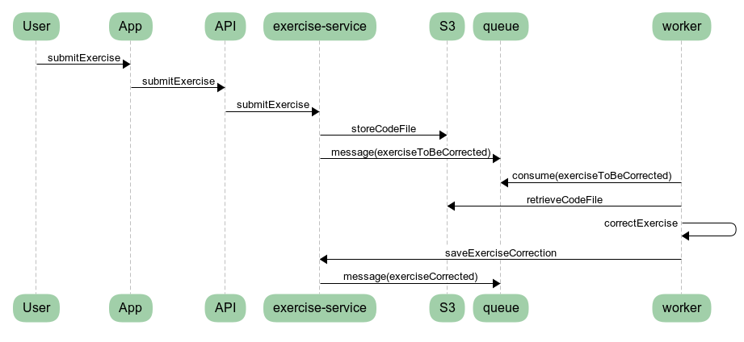
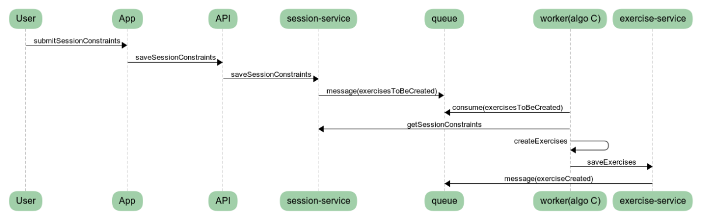

# Exo 1: Architecture

## Diagramme d'entités

## Choix techniques

Je propose une architecture de type microservices déployée sur le cloud (chez AWS par exemple) comprenant:

- une application web de type SPA s'exécutant dans un navigateur
- une API Gateway en GraphQL recevant les requêtes de l'application et appelant les services adaptées en JSON-RPC
- Du cache distribuée pour la gestion des sessions
- Des services (authentification-service, session-service, notification-service, exercice-service...)
    - répondent aux requêtes de l'API Gateway
    - émettent des messages
    - réagissent à des messages
    - ne peuvent pas communiquer directement entre eux
- Des workers
    - réagissent aux messages
    - exécutent le code fourni par les candidats (dans un environnement dédié et sécurisé) et publient le résultat
    - exécutent l'algorithme en C de création des exercices techniques
    - peuvent communiquer directement avec les services
- Des [language server](https://langserver.org/) chargés de fournir les fonctionnalités d'un IDE (autocomplétion, correction syntaxique, ...) pour chaque langage supporté, et communiquant avec la partie IDE de l'application grâce au [Language Server Protocol](https://microsoft.github.io/language-server-protocol/) en JSON-RPC
- Une base de données relationnelle pour stocker les données des services

### Infrastructure

Pour répondre à la forte charge du lancement unique, je propose une architecture _scalable_:

- plusieurs instances d'un même service, worker, de l'API Gateway et des language servers dont le nombre sera adapté après des tests de charge
- répartition de charge pour l'API Gateway, les language servers, les services
- on privilégie les traitements asynchrone via l'utilisation d'une file de message et de workers
- de la mise à l'échelle automatique pour s'adapter dynamiquement à des fluctuations de charge et réduire le nombre d'instances une fois le pic de charge du lancement passé
- du monitoring avec une stack de type ELK (logging + technologie de recherche à travers les logs + une technologie de visualisation et d'alerte)
- containerisation pour accélérer le déploiement de nouvelles instances et la suppression des instances défectueuses

Choix Technique | Technologie | Alternative |
--------------- | ------------| ------------|
Répartition de charge    | Elastic Load Balancing (AWS)   | Nginx |
Auto-scaling+Container   | Elastic Container Service (AWS)| Kubernetes + Docker |
File de messages         | Simple Queue Service           | RabbitMQ |
Monitoring               | ElasticSearch/Logstash/Kibana  | Prometheus+Grafana |
Base de données          | Amazon Aurora                  | PostgresSQL |
Content Delivery Network | Cloudfront                     | Cloudflare |
Hébergement Ressources Statiques | Simple Storage Service (AWS S3) | Serveur dédié + NGINX |
Cache                    | Memcached (AWS Elasticache)    | Redis |

### Frontend

Je favorise GraphQL par rapport à REST. Cela permet de combiner en une seule technologie caching, gestion de l'état de l'application, communication avec l'API en prévenant over-fetching et under-fetching, typage... le tout s'interfaçant naturellement avec React.  
Le build de l'application sera stocké et hébergé sur S3 et servi via un CDN.

Choix Technique | Technologie | Alternative |
--------------- | ------------| ------------|
Modèle Applicatif      | Single Page App | Multi Page App |
Langage                | Javascript      | Typescript     |
Framework              | React           | VueJS          |
Gestion d'état         | Apollo Client   | Redux          |
Communication avec API | GraphQL         | REST           |
Communication avec language servers | JSON-RPC | n/a |

### Backend

Je propose d'adopter le Go comme langage de programmation, un langage moderne et performant à la communauté grandissante et qui a fait ses preuves en étant le langage de nombreuses technologies et produits "cloud-native" (kubernetes, docker, istio, traefik...).  
On utilisera [gRPC](https://grpc.io) pour la communication entre API Gateway et services et entre workers et services, qui offre de meilleures performances comparé à des alternatives comme JSON-RPC.
L'utilsation de cache distribuée permettra de gérer les données de session (cf. https://aws.amazon.com/fr/caching/session-management/ pour les différentes stratégies envisageables).  
On s'appuiera sur une base de données relationnelle (MySQL ou PostgreSQL) aved réplication master-slave et partitionnement si nécessaire pour le stockage des données des services. Ces solutions me semblent suffisamment flexibles et performantes tout en offrant la rigueur d'un modèle relationnel. Je ne vois pas de justification (complexité du modèle de données, volumétrie...) pour utiliser une technologie NoSQL (Mongo, Cassandra, Neo4J, DynamoDB).  
Le code écrit par les candidats sera stocké sur S3.

Choix Technique | Technologie | Alternative |
--------------- | ------------| ------------|
langage de programmation (service et workers) | Golang        | NodeJS |
framework de développement                    | go-kit        | HapiJS |
communication API-Gateway -> Services         | gRPC          | JSON-RPC |
communication Workers -> Services             | gRPC          | JSON-RPC |
Base de données                               | Amazon Aurora | PostgreSQL |
Cache                                         | Memcached     | Redis |

## Diagramme d'architecture

### Diagramme de séquence - correction exercice

### Diagramme de séquence - génération des exercices

## Conception de l'algorithme en C

Je n'ai pas d'idée précise en terme de conception de l'algorithme.
Plutôt que générer dynamiquement des exercices, j'aurai tendance à aller chercher en base de donnée un référentiel indiquant pour chaque contrainte quels exercices (préconçus) appliquer, en modulant en fonction de règles métiers (critères de difficulté, réduction du nombre d'exercices si nombreuses contraintes, etc).
