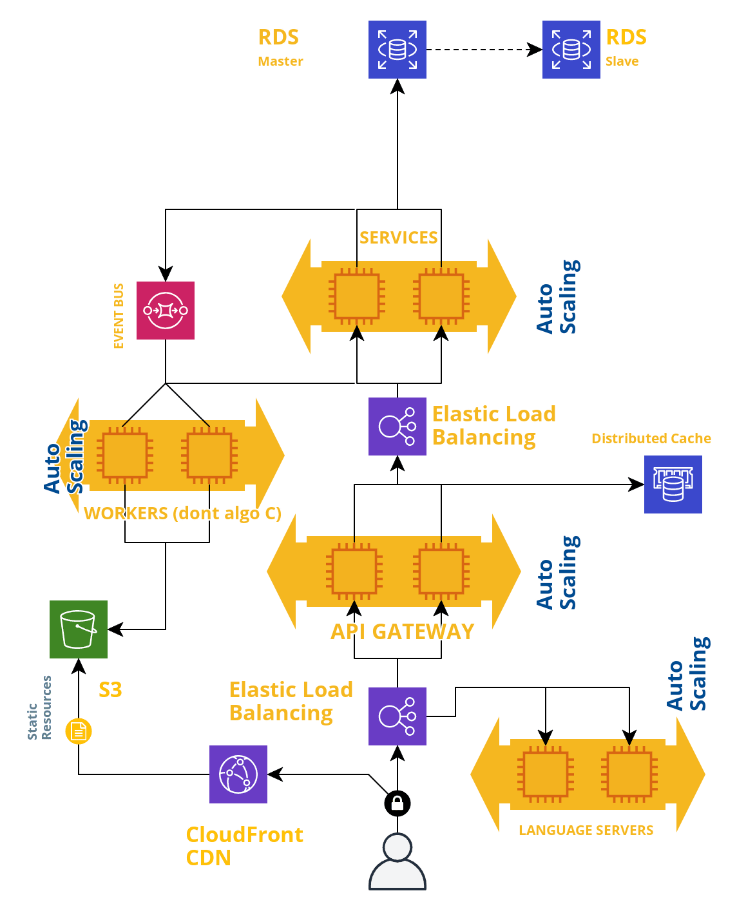

# Exo 1: Architecture

## Diagramme d'entités

## Choix techniques

Je propose une architecture de type microservices déployée sur le cloud (chez AWS par exemple) comprenant:
- une application web de type SPA s'exécutant dans un navigateur
- une API Gateway en GraphQL recevant les requêtes de l'application et appelant les services adaptées en JSON-RPC
- Du cache distribuée pour la gestion des sessions
- Des services (authentification-service, session-service, notification-service, exercice-service...)
    - répondant aux requêtes de l'API Gateway
    - émettant des messages
    - réagissant à des messages
- Des workers
    - réagissent aux messages
    - exécutent le code fourni par les candidats et publient le résultat
    - exécutent l'algorithme en C de création des exercices techniques
- Des [language server](https://langserver.org/) chargés de fournir les fonctionnalités d'un IDE (autocomplétion, correction syntaxique, ...) pour chaque langage supporté, et communiquant avec la partie IDE de l'application grâce au [Language Server Protocol](https://microsoft.github.io/language-server-protocol/) en JSON-RPC
- Une base de données relationnelle pour stocker les données des services

### Infrastructure

Pour répondre à la forte charge du lancement unique, je propose une architecture 
_scalable_:
- plusieurs instances d'un même service, worker, de l'API Gateway et des language servers dont le nombre sera adapté après des tests de charge
- répartition de charge pour l'API Gateway, les language servers, les services
- on privilégie les traitements asynchrone via l'utilisation d'une file de message et de workers
- de la mise à l'échelle automatique pour s'adapter dynamiquement à des fluctuations de charge et réduire le nombre d'instances une fois le pic de charge du lancement passé
- du monitoring avec une stack de type ELK (logging + technologie de recherche à travers les logs + une technologie de visualisation et d'alerte)
- containerisation pour accélérer le déploiement de nouvelles instances et la suppression des instances défectueuses

Choix Technique | Technologie | Alternative |
--------------- | ------------| ------------|
Répartition de charge | Elastic Load Balancing (AWS) | Nginx |
Auto-scaling+Container | Elastic Container Service (AWS)| Kubernetes + Docker |
File de messages | Simple Queue Service | RabbitMQ |
Monitoring | ElasticSearch/Logstash/Kibana | Prometheus+Grafana |
Base de données | Amazon Aurora | PostgresSQL |
Content Delivery Network | Cloudfront | Cloudflare |
Ressources Statiques | Simple Storage Service (AWS S3) | Serveur dédié + NGINX |
Cache | Memcached | Redis | 

### Frontend

Choix Technique | Technologie | Alternative |
--------------- | ------------| ------------|
Framework | Elastic Load Balancing (AWS) | Nginx |

### Backend

Choix Technique | Technologie | Alternative |
--------------- | ------------| ------------|
Framework | Elastic Load Balancing (AWS) | Nginx |

## Diagramme d'architecture

## Conception de l'algorithme en C